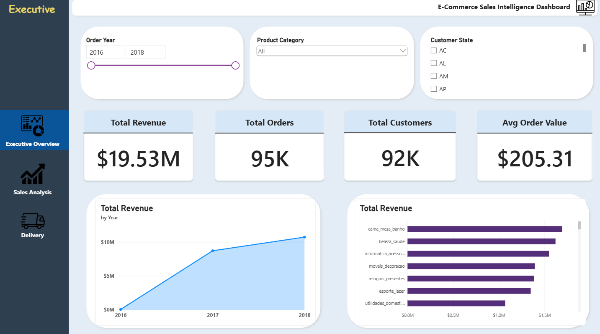
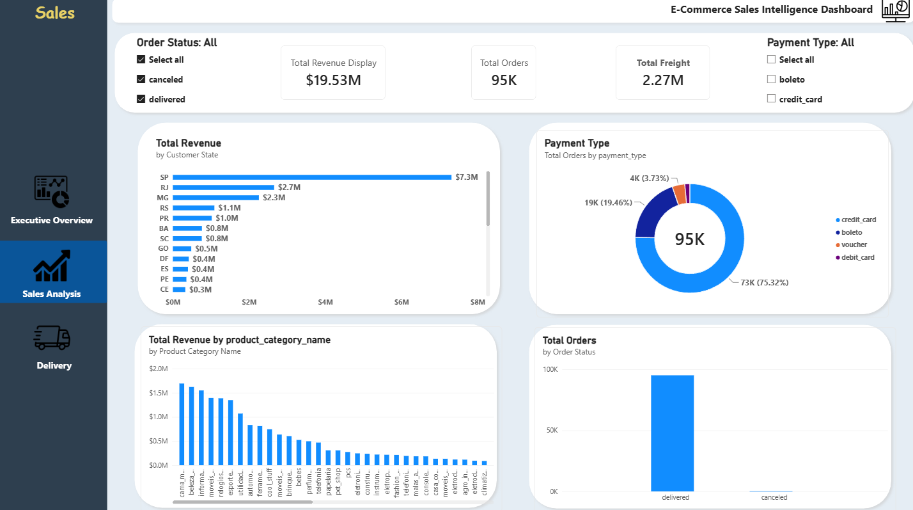
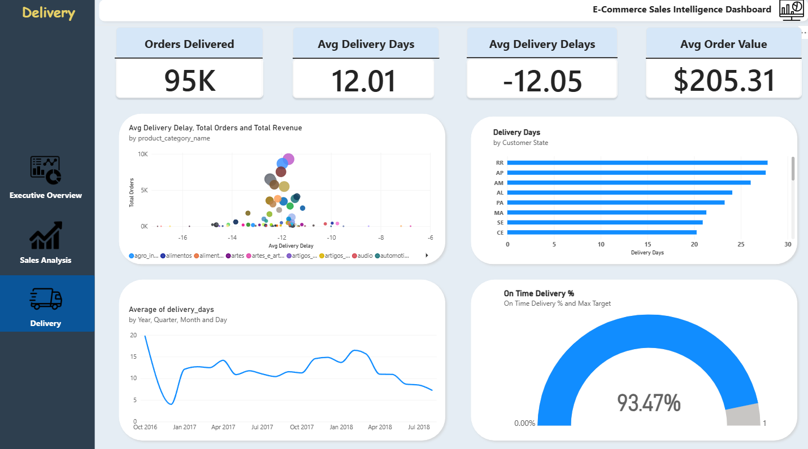

# Brazilian E-Commerce Sales Intelligence Dashboard

An end-to-end analytics portfolio project built with Python, Pandas, and Power BI using Brazilian e-commerce order data.

The final report turns cleaned order data into three interactive pages for executive reporting, sales analysis, and delivery performance.

## Dashboard Preview

| Executive Overview | Sales Analysis | Delivery Analysis |
| --- | --- | --- |
| Revenue, orders, customers, and category performance | State, payment, category, and order-status analysis | Delivery time, delay, and on-time performance |

Open the full-size previews in the [Dashboard Screenshots](#dashboard-screenshots) section below.

## 📊 Project Overview

This project analyzes Brazilian e-commerce sales data to understand sales performance, customer behavior, product performance, payment methods, and delivery performance.

I used the notebook for data preparation and analysis, then extended the Power BI report with additional visuals, delivery-focused KPIs, and DAX measures. The result is an interactive report that can be filtered by year, category, state, order status, and payment type.

## 🎯 Project Objectives

The main objectives of this project are to:

* Analyze overall e-commerce sales performance
* Track revenue and order trends over time
* Understand customer distribution across Brazilian states
* Identify product categories contributing to revenue
* Analyze payment methods used by customers
* Examine order status and delivery performance
* Build an interactive Power BI dashboard for business insights

## 🛠️ Tools & Technologies

* **Python** – Data cleaning and preparation
* **Pandas** – Data manipulation and analysis
* **Jupyter Notebook** – Exploratory data analysis
* **Power BI** – Interactive dashboard and visualization
* **DAX** – Measures and calculations in Power BI
* **Git & GitHub** – Version control and project sharing

## ▶️ How to Use This Repository

1. Review the cleaned dataset in `data/cleaned/Sales.csv`.
2. Open `notebooks/ecommerce_sales_analysis.ipynb` to review the analysis and preparation workflow.
3. Open `powerbi/ecommerce_sales_dashboard.pbix` in Power BI Desktop to interact with the report.
4. Use the screenshots below when viewing the project on GitHub, where `.pbix` files cannot be rendered directly.

The raw and cleaned CSV files are included so the transformation from source data to dashboard-ready data can be followed.

## 📁 Project Structure

```text
ecommerce-sales-powerbi/
│
├── data/
│   ├── raw/
│   │   └── ecommerce_sales.csv
│   └── cleaned/
│       └── Sales.csv
│
├── notebooks/
│   └── ecommerce_sales_analysis.ipynb
│
├── powerbi/
│   └── ecommerce_sales_dashboard.pbix
│
├── screenshots/
│   ├── executive_dashboard.png
│   ├── sales_analysis.png
│   └── delivery_analysis.png
│
└── README.md
```

## 📌 Dataset

The dataset contains Brazilian e-commerce order information, including:

* Orders
* Customers
* Products
* Product categories
* Sellers
* Payment methods
* Prices
* Freight values
* Order status
* Purchase dates
* Delivery dates
* Estimated delivery dates
* Customer locations

The dataset contains approximately **113,000 records** and covers orders from **2016 to 2018**.

## 🧹 Data Preparation

The data was cleaned and prepared using Python and Pandas.

The main preparation steps included:

* Removing unnecessary columns
* Converting date columns into appropriate datetime formats
* Handling date-based calculations
* Creating revenue-related fields
* Creating year, month, quarter, and year-month fields
* Calculating delivery duration
* Calculating delivery variance compared with estimated delivery
* Preparing the cleaned dataset for Power BI

### Important calculated fields

Some of the additional fields created during preparation include:

* `revenue`
* `order_year`
* `order_month`
* `order_month_name`
* `order_quarter`
* `year_month`
* `delivery_days`
* `delivery_delay_days`

## 📈 Power BI Dashboard

The Power BI report contains three main pages.

### 1. Executive Overview

This page provides a high-level view of the business.

Key metrics include:

* Total Revenue
* Total Orders
* Total Customers
* Average Order Value

Visualizations include:

* Revenue by year
* Revenue by product category
* KPI cards and interactive filters

### 2. Sales Analysis

This page focuses on sales, products, customers, and payment behavior.

Visualizations include:

* Revenue by customer state
* Orders by payment type
* Revenue by product category
* Orders by order status
* Order-status and payment-type filters

### 3. Delivery Analysis

This page focuses on order fulfillment and delivery performance.

Key metrics include:

* Average Delivery Days
* Average Delivery Delay
* Orders Delivered

Visualizations include:

* Average delivery days by customer state
* Delivery days by category
* Average delivery trend over time
* On-time delivery percentage

## ✨ My Work

The dashboard was developed from the existing cleaned data workflow and then refined with my own reporting additions:

* Added the delivery analysis page with delivery-day, delay, and on-time metrics.
* Added extra category, state, payment, and order-status visuals for business comparison.
* Created DAX measures for revenue, orders, customers, average order value, freight, delivery days, and delivery delay.
* Reworked the report layout into a consistent three-page dashboard with navigation and slicers.

## 🔢 Key Power BI Measures

Some of the main DAX measures created for the dashboard are:

```DAX
Total Revenue =
SUM(Sales[revenue])
```

```DAX
Total Orders =
DISTINCTCOUNT(Sales[order_id])
```

```DAX
Total Customers =
DISTINCTCOUNT(Sales[customer_unique_id])
```

```DAX
Total Products =
DISTINCTCOUNT(Sales[product_id])
```

```DAX
Average Order Value =
DIVIDE(
    [Total Revenue],
    [Total Orders],
    0
)
```

```DAX
Total Freight =
SUM(Sales[freight_value])
```

Additional delivery measures were created to analyze average delivery time and delivery performance.

Representative delivery measures include:

```DAX
Average Delivery Days =
AVERAGE(Sales[delivery_days])
```

```DAX
Average Delivery Delay =
AVERAGE(Sales[delivery_delay_days])
```

These measures support the delivery KPI cards, trend visual, state comparison, and on-time delivery visual shown in the report.

## 💡 Key Findings

The analysis provides several useful observations about the e-commerce business:

* The dataset contains approximately **95K unique orders** and **92K unique customers**.
* Total revenue in the cleaned dataset is approximately **19.5 million**.
* The average order value is approximately **205**.
* Most orders in the dataset were successfully delivered.
* Revenue and order activity can be analyzed across different Brazilian states and product categories.
* Payment method analysis shows how customers completed their purchases.
* Delivery analysis allows comparison between actual delivery time and estimated delivery dates.

These findings can help understand sales performance, customer behavior, and operational efficiency.

## 📸 Dashboard Screenshots

### Executive Overview



### Sales Analysis



### Delivery Analysis



## 🚀 Project Workflow

The project followed this workflow:

```text
Raw Dataset
     ↓
Python / Pandas
     ↓
Data Cleaning & Transformation
     ↓
Exploratory Analysis
     ↓
Cleaned CSV
     ↓
Power BI
     ↓
DAX Measures and Report Design
     ↓
Interactive Dashboard
     ↓
GitHub Portfolio Project
```

## Repository Notes

* The Power BI report is the primary interactive deliverable; the screenshots provide a quick preview for GitHub visitors.
* The notebook and CSV files are kept in their existing folders so the cleaning and dashboard workflow remain easy to follow.
* Dashboard totals can vary if the source data, filters, or Power BI model are changed.

## 📚 Skills Demonstrated

Through this project, I practiced:

* Data cleaning with Pandas
* Working with dates and time-based data
* Exploratory data analysis
* Creating calculated columns
* Creating DAX measures
* Designing interactive Power BI dashboards
* Using slicers and KPI cards
* Creating business-focused visualizations
* Organizing a reproducible data analytics project
* Presenting business insights for different audiences
* Using Git and GitHub for version control

## 🔮 Next Improvements

Possible future improvements include:

* Adding customer segmentation
* Adding a seller performance page
* Adding customer retention and repeat-purchase analysis
* Adding advanced time-series analysis
* Improving dashboard design and navigation
* Adding automated data refresh
* Creating additional business KPIs

## 👤 Author

**Sayash**

This project was created as part of my data analytics portfolio to demonstrate practical skills in **Python, Pandas, Power BI, DAX, and GitHub**.
